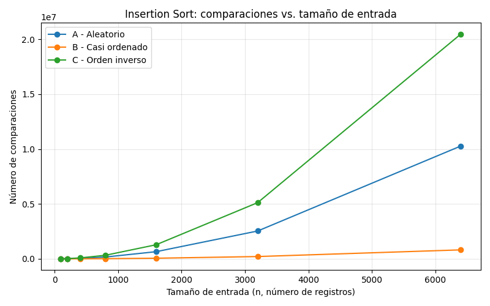
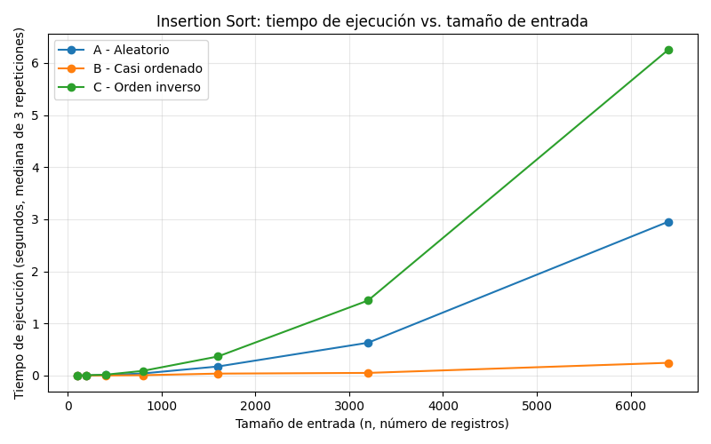
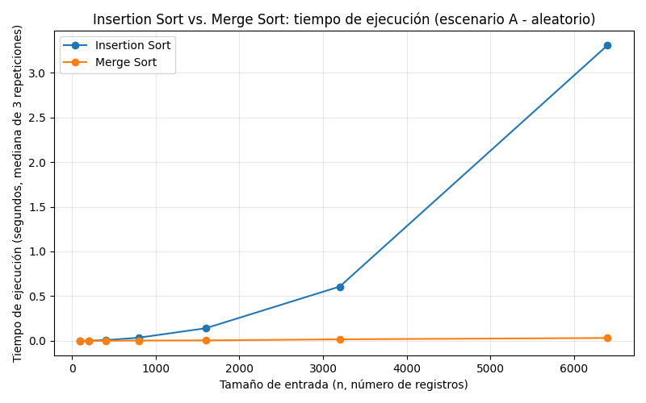

# Laboratorio evaluativo 01 — Fundamentos, complejidad y recurrencias

**Nombre completo:** Juliana Arroyave Arango

## Instrucciones para reproducir el experimento

1. Active el entorno virtual desde la raíz del repositorio:
   ```bash
   source venv/bin/activate
   ```
2. Verifique que `matplotlib` esté instalado (ya debe estar en `requirements.txt`):
   ```bash
   pip install -r requirements.txt
   ```
3. Desde la carpeta `lab1-fundamentos-complejidad-recurrencias/`, ejecute cada parte práctica:
   ```bash
   python parte3_casos.py       # Parte 3: genera graficas/parte3_comparaciones.png y graficas/parte3_tiempo.png
   python parte4_complejidad.py # Parte 4: genera graficas/parte4_tiempo.png
   ```

## Parte 1 — Analizar el algoritmo antes de comprar hardware

El algoritmo debe analizarse primero porque llevar ocho años entregando el resultado correcto no garantiza que siga siendo viable cuando cambian las condiciones del sistema. En el caso de la Secretaría de Salud, considero que Insertion Sort era correcto para las condiciones iniciales, porque la cantidad de registros se ajustaba a la ventana de tiempo disponible y cumplía con su función: ordenar los índices de mayor a menor riesgo.

Sin embargo, corrección y eficiencia no significan lo mismo. Actualmente se manejan aproximadamente 1.200.000 registros y el proceso tarda cerca de 10 horas, cuando la restricción es completar el procesamiento dentro de una ventana de cuatro horas. El algoritmo sigue produciendo el resultado esperado, pero ya no es eficiente para ese volumen de datos, porque no logra entregar la información procesada oportunamente.

Duplicar la velocidad del servidor sería una solución temporal, no una solución al problema de fondo. Solo permitiría ganar tiempo hasta que el volumen de datos vuelva a crecer. Si la información continúa aumentando, se podría repetir el mismo ciclo: aumentar la capacidad del servidor, funcionar durante un tiempo y volver a superar la ventana disponible. Por eso, aunque el hardware pueda mejorar el tiempo de ejecución, no garantiza que el problema no vuelva a presentarse. Además, Insertion Sort tiene un comportamiento cuadrático, por lo que el crecimiento del trabajo puede ser mucho mayor que el aumento constante de la capacidad del hardware.

Algo similar viví en un caso propio, distinto a Tamiza, relacionado con el seguimiento de tratamientos externos. El proceso recorría las tablas MovEnc y MovDet para validar los movimientos de los equipos, como su salida, con quién se encontraba y si ya había vuelto a ingresar. En un mes podían moverse entre 15.000 y 20.000 equipos, cada uno con varios procesos por validar.

Al finalizar el mes, el proceso debía enviar un correo de cierre unos segundos después de presionar el botón, pero en ocasiones tardaba 20 minutos o más y además hacía lento el sistema. Aunque el proceso cumplía su función, incumplía la restricción de tiempo esperada. Por eso reprocesé el algoritmo para hacerlo más ágil y reducir los reprocesos internos. Esto permitió agilizar el proceso y que el correo cumpliera con el tiempo esperado.

## Parte 2 — Responsabilidad ambiental y ética de la implementación

Como responsable técnico de Tamiza, considero que elegir el algoritmo no es únicamente una decisión de rendimiento, sino también una decisión con consecuencias ambientales y éticas, debido al volumen de información que se procesa y a que el proceso se ejecuta todas las madrugadas.

**Dimensión ambiental**

Un proceso que tarda más tiempo requiere mantener los recursos de cómputo funcionando durante más tiempo y, por lo tanto, consume una mayor cantidad de electricidad. Esto representa un impacto ambiental que puede parecer pequeño en una sola ejecución, pero se vuelve significativo cuando el proceso se repite todas las madrugadas durante años.

Además, en este caso el problema no es un gasto fijo. Si la cantidad de datos continúa creciendo y el algoritmo tiene un comportamiento que aumenta más rápido que el volumen de datos, también puede aumentar el tiempo de procesamiento y, con ello, el consumo de recursos. Por esta razón, un algoritmo ineficiente no solo afecta el tiempo de respuesta del sistema, sino que también puede traducirse en una mayor huella ambiental.

**Dimensión ética**

Si el proceso no termina correctamente dentro de la ventana disponible, se puede generar una lista parcial o que no esté correctamente ordenada. Esto puede perjudicar directamente a los pacientes, porque aquellos con mayor riesgo podrían no quedar ubicados en la posición que les corresponde y, por lo tanto, podrían ser contactados después de otros pacientes que tienen menor prioridad.

En este caso, el costo más grave lo asume el paciente, porque puede retrasarse una atención que requiere prioridad. También existe un costo para el operador del centro de contacto, quien puede recibir reclamos o presión de los pacientes y sus familias por una situación que realmente proviene de una falla técnica que no está bajo su control. La Secretaría y el equipo de desarrollo también asumen consecuencias por el funcionamiento incorrecto del sistema, aunque el impacto directo sobre la atención recae primero en las personas que esperan ser contactadas.

**Tensión propia del caso**

Existe además una responsabilidad adicional porque el orden de la lista determina a quién se llama primero. No se trata simplemente de ordenar datos, sino de establecer una prioridad entre miles de personas que necesitan atención. Por eso, el algoritmo debe ser correcto no solo en el sentido técnico de producir una lista ordenada, sino también en garantizar que el criterio utilizado para establecer esa prioridad se aplique correctamente.

Un error de posición puede significar que una persona con mayor riesgo espere más tiempo para ser contactada. Por eso, además de buscar eficiencia, existe la obligación ética de garantizar la corrección y confiabilidad del ordenamiento, ya que el resultado tiene consecuencias reales sobre las personas.

## Parte 3 — Peor caso, mejor caso y caso promedio

### 3.1 — Explicación

Para analizar el comportamiento de un algoritmo se pueden considerar tres casos: peor, mejor y promedio. Para un tamaño fijo de entrada, por ejemplo, un lote de 1.200.000 registros, el peor caso corresponde a la entrada que requiere el mayor tiempo de ejecución entre todas las entradas posibles de ese mismo tamaño. El mejor caso corresponde a la entrada que requiere el menor tiempo, mientras que el caso promedio representa el tiempo medio de ejecución considerando las diferentes entradas posibles del mismo tamaño.

Para decidir si Insertion Sort debería entrar en producción en Tamiza, utilizaría el peor caso, porque la ventana de cuatro horas es una restricción estricta. No sería suficiente saber que normalmente el algoritmo puede terminar dentro de ese tiempo, ya que existe la posibilidad de recibir una entrada que requiera mucho más procesamiento. Analizar el peor caso permite conocer hasta dónde puede llegar el tiempo de ejecución y tomar la decisión teniendo en cuenta el escenario más desfavorable.

Antes de realizar las mediciones, mi predicción es que el escenario C, de orden inverso, será el peor caso para Insertion Sort. Esto se debe a que los registros están organizados exactamente al contrario del orden que se necesita, por lo que cada nuevo elemento debe desplazarse hacia atrás para encontrar su posición correspondiente. De esta manera, se realizan muchas comparaciones y movimientos a lo largo de la lista.

Mi predicción para el mejor caso es el escenario B, casi ordenado, porque el 98 % de los registros ya se encuentra ordenado según el riesgo y solamente el 2 % restante corresponde a datos nuevos que se agregan al final. En este escenario, Insertion Sort tendría que realizar muchos menos movimientos para dejar la lista completamente ordenada.

Finalmente, considero que el escenario A, aleatorio, quedaría entre ambos casos, porque los registros no tienen una relación previa con el índice de riesgo y el algoritmo tendrá que realizar una cantidad intermedia de comparaciones y movimientos.

Esta es mi predicción previa a realizar el experimento, por lo que mantendría estas conclusiones en el informe y, si las mediciones muestran un resultado diferente, explicaría posteriormente por qué el comportamiento observado no coincidió con la predicción inicial.

### 3.2 — Demostración experimental

[Código de la Parte 3](./parte3_casos.py) · [Código de `insertion_sort`](./algoritmos.py) · [Código de los generadores](./datos.py)

Se midió `insertion_sort` sobre los tres escenarios (A, B, C) para siete tamaños de entrada (100, 200, 400, 800, 1600, 3200, 6400), repitiendo cada medición 3 veces y tomando la mediana del tiempo para reducir el ruido del sistema operativo. No se cronometró la generación de los datos, solo la llamada al algoritmo.





Los resultados experimentales confirman la predicción hecha en 3.1: el escenario C (orden inverso) resultó ser el peor caso, con el mayor número de comparaciones y el mayor tiempo de ejecución para cada tamaño de entrada. El escenario B (casi ordenado) resultó ser el mejor caso, con una curva claramente por debajo de las otras dos. El escenario A (aleatorio) se aproxima al caso promedio, ubicándose siempre entre los otros dos escenarios. Esto coincide completamente con la predicción realizada antes de medir.

## Parte 4 — Complejidad de merge sort e insertion sort: cálculo y validación

### 4.1 — Cálculo teórico

**¿De dónde sale la recurrencia de Merge Sort?**

La recurrencia de Merge Sort es:

$$T(n) = 2T(n/2) + \Theta(n)$$

Esta fórmula representa el trabajo que hace el algoritmo cuando ordena una lista de n elementos.

- **2T(n/2)**: Merge Sort divide la lista en dos partes iguales, por eso aparece el 2. Cada parte tiene aproximadamente n/2 elementos y se vuelve a ordenar utilizando el mismo algoritmo. Por eso aparece T(n/2).
- **Θ(n)**: Después de ordenar las dos partes, Merge Sort tiene que juntarlas nuevamente en una sola lista ordenada. Para hacer esto, va comparando los elementos de ambas partes y los va colocando en orden. Como tiene que revisar los n elementos, esta parte toma un tiempo proporcional a n, por eso se representa como Θ(n).

En palabras sencillas: el tiempo que tarda Merge Sort en ordenar una lista de tamaño n es igual al tiempo de ordenar sus dos mitades, más el tiempo necesario para volver a unir esas dos mitades.

**Resolución con el método maestro**

La fórmula general del método maestro es:

$$T(n) = aT(n/b) + f(n)$$

En nuestro caso:
- $a = 2$, porque se generan 2 subproblemas.
- $b = 2$, porque cada subproblema tiene la mitad del tamaño.
- $f(n) = \Theta(n)$, porque combinar las dos partes cuesta proporcionalmente a n.

Calculamos:

$$n^{\log_b a} = n^{\log_2 2} = n$$

Como $f(n) = \Theta(n)$ y $n^{\log_b a} = n$ tienen el mismo orden de crecimiento, se aplica el **Caso 2** del método maestro, que establece:

$$T(n) = \Theta(n^{\log_b a} \cdot \log n)$$

Sustituyendo:

$$T(n) = \Theta(n \log n)$$

Por lo tanto, la complejidad de Merge Sort es **Θ(n log n)**.

**Cálculo línea a línea de Insertion Sort**

```python
def insertion_sort(datos):
    lista = datos.copy()              # línea 1
    comparaciones = 0                 # línea 2
    for i in range(1, len(lista)):    # línea 3
        actual = lista[i]             # línea 4
        j = i - 1                     # línea 5
        while j >= 0:                 # línea 6
            comparaciones += 1        # línea 7
            if lista[j] < actual:     # línea 8
                lista[j + 1] = lista[j]  # línea 9
                j -= 1                 # línea 10
            else:
                break                  # línea 11
        lista[j + 1] = actual         # línea 12
    return lista, comparaciones       # línea 13
```

| Línea | Se ejecuta... | Peor caso (orden inverso) | Mejor caso (ya ordenada) |
|---|---|---|---|
| 1, 2 | Una sola vez, antes del bucle | 1 | 1 |
| 3 | Control del `for` | n | n |
| 4, 5 | Una vez por iteración externa | n-1 | n-1 |
| 6, 7, 8 | Comparación entre elementos | n(n-1)/2 | n-1 |
| 9, 10 | Solo cuando hay desplazamiento | n(n-1)/2 | 0 |
| 11 | Solo cuando se encuentra la posición | 0 | n-1 |
| 12 | Una vez por iteración externa | n-1 | n-1 |

En el peor caso (escenario C, orden inverso), cada elemento en la posición i requiere i comparaciones/desplazamientos contra los elementos ya colocados. Sumando desde i=1 hasta i=n-1:

$$1 + 2 + 3 + \dots + (n-1) = \frac{n(n-1)}{2}$$

Esto coincide con lo verificado en el código (n=5 → 10 comparaciones = 5·4/2). En el mejor caso (ya ordenada), cada elemento se compara una sola vez con el anterior, por lo que son exactamente n-1 comparaciones.

Las líneas dominantes en el peor caso dependen de n(n-1)/2, que crece proporcional a n². Por lo tanto:

$$T_{peor}(n) = \Theta(n^2) \qquad T_{mejor}(n) = \Theta(n)$$

**Tabla de complejidades**

| Algoritmo | Mejor caso | Peor caso | Caso promedio |
|---|---|---|---|
| Insertion Sort | Θ(n) | Θ(n²) | Θ(n²) |
| Merge Sort | Θ(n log n) | Θ(n log n) | Θ(n log n) |

### 4.2 — Validación experimental

[Código de `merge_sort`](./algoritmos.py) · [Código de la Parte 4](./parte4_complejidad.py)

Se midió el tiempo de ejecución de Insertion Sort y Merge Sort sobre el escenario A (aleatorio) de Tamiza, con los mismos siete tamaños de entrada de la Parte 3, usando `time.perf_counter()` y la mediana de 3 repeticiones por medición.



Para el algoritmo de Tamiza, Merge Sort resulta más adecuado cuando el tamaño de los datos aumenta, ya que su tiempo de ejecución crece más lentamente que el de Insertion Sort. Esto coincide con lo calculado en 4.1, donde Insertion Sort tiene una complejidad de Θ(n²) y Merge Sort de Θ(n log n). Para tamaños pequeños la diferencia es menor porque Merge Sort tiene un costo adicional por dividir los datos, hacer llamadas recursivas y luego combinar las partes, pero a medida que aumenta la cantidad de datos, la ventaja de su menor crecimiento se hace mucho más evidente.

### 4.3 — Concepto técnico a la Secretaría de Salud

Para el proceso de ordenamiento de los registros de Tamiza, recomiendo utilizar Merge Sort en lugar de mantener la implementación actual con Insertion Sort. La razón principal es que el canal de entrada puede cambiar sin aviso entre los escenarios A, B y C, por lo que no es conveniente diseñar la solución suponiendo que los datos siempre llegarán casi ordenados. Insertion Sort presenta un comportamiento diferente dependiendo del orden de entrada, mientras que Merge Sort mantiene una complejidad de Θ(n log n), por lo que su comportamiento es más estable ante cambios en la distribución de los datos. Además, esta decisión permite mantener una sola implementación para los diferentes tipos de entrada.

Para el volumen esperado de 1.200.000 registros, la ventana disponible es de 4 horas. De acuerdo con las mediciones realizadas y la extrapolación a partir de ellas, el Insertion Sort actual tardaría aproximadamente 10 horas en procesar este volumen, por lo que no cumpliría con la ventana establecida. Esta cifra es una estimación, no una medición directa con 1.200.000 registros, ya que las pruebas realizadas utilizaron tamaños menores. Para Merge Sort, debido a su crecimiento de Θ(n log n), la extrapolación muestra un crecimiento mucho menor que el de Insertion Sort, por lo que es el algoritmo más adecuado para procesar grandes volúmenes de registros.

Respecto a la propuesta de utilizar un servidor con el doble de velocidad, esta mejora podría reducir el tiempo de ejecución, pero no solucionaría el problema de crecimiento del algoritmo. Por ejemplo, en una de las mediciones realizadas con 6.400 registros, Insertion Sort tardó aproximadamente 3,31 segundos, mientras que Merge Sort tardó 0,032 segundos para la misma cantidad de datos. Esto muestra que, aunque una mejora en el hardware puede ayudar a disminuir los tiempos, el algoritmo utilizado sigue siendo un factor importante. Por eso, para un volumen mucho mayor de registros, resulta más conveniente mejorar el algoritmo en lugar de depender únicamente de aumentar la capacidad del servidor.

Finalmente, además del tiempo de ejecución, se debe considerar que Merge Sort requiere memoria adicional para realizar el proceso de combinación de las partes ordenadas. Este costo debe tenerse en cuenta al dimensionar el sistema. Sin embargo, permite tener un comportamiento más predecible cuando cambia el orden de los datos de entrada.

Otro riesgo a considerar es que el buen desempeño actual de Insertion Sort depende de una condición externa que el equipo de desarrollo no controla: que el flujo de reproceso siga entregando datos casi ordenados (escenario B). Si el canal de origen cambia, o si el proceso de reproceso deja de ordenar la lista del día anterior antes de anexar los registros nuevos, los datos podrían parecerse más a los escenarios A o C, y el tiempo de ejecución de Insertion Sort se degradaría considerablemente, tal como se observó en las mediciones de la Parte 3. Merge Sort, en cambio, no depende de ninguna condición sobre el orden de entrada: su complejidad se mantiene en Θ(n log n) sin importar cómo lleguen los datos. Por esta razón, mantener Insertion Sort en producción es una decisión frágil, sujeta a un supuesto que puede dejar de cumplirse sin aviso, mientras que Merge Sort ofrece un comportamiento robusto y predecible ante ese mismo riesgo.

Por estas razones, se recomienda utilizar Merge Sort para el proceso de ordenamiento de los registros de Tamiza.